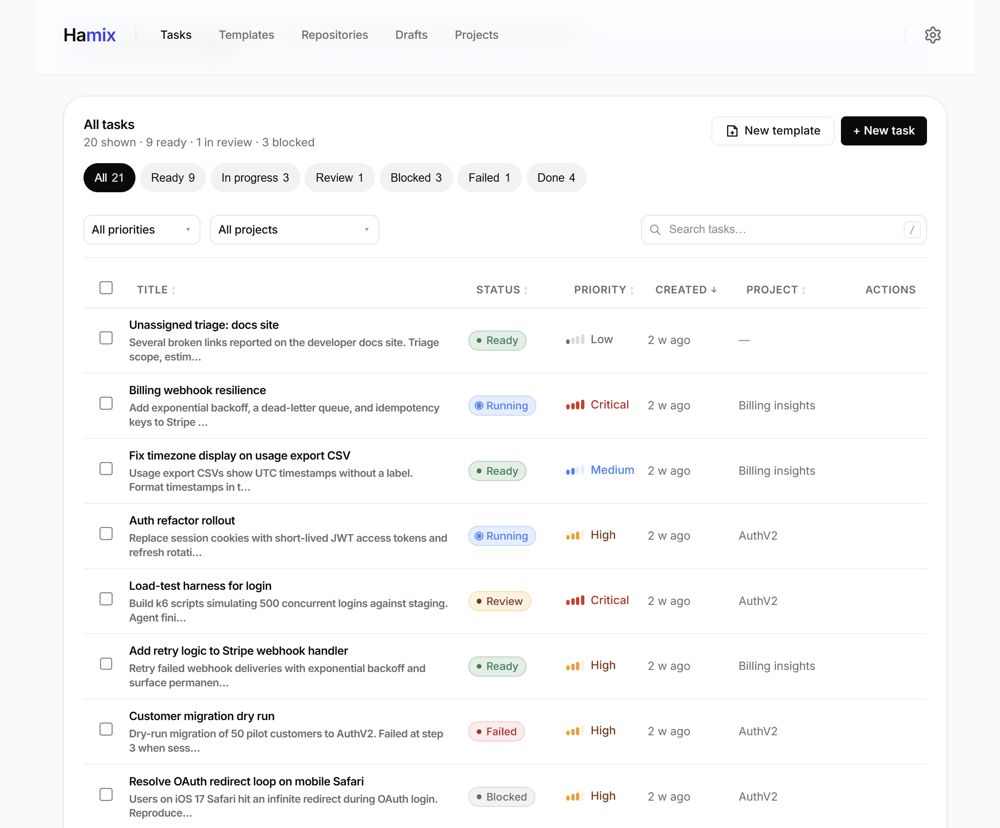

  

Control plane for coding agents. Coordinates Cursor CLI, Claude Code, Codex, and other agentic systems.

## Why Hamix exists

To address the following problems and more:

1. Chat-based interfaces introduce too much variability into software engineering.
2. Developers already coordinate multiple AI agents manually. Hamix makes that workflow explicit and repeatable.
3. Existing project management tools were designed for human teams, not AI-driven software engineering.

## Initial Features

**Task Templates** —> Define a task once, instantiate it many times.

**Execute & Verify** —> One agent executes the task, another independently verifies the acceptance criteria.

**Execution History** —> Every execution is recorded with commits, verification results, and an audit trail.

**Acceptance Criteria** —> Define what "done" means with checklists and optional verification commands.

**Runner Adapters** —> Run Hamix with different agentic systems.

## Roadmap

The current development plan is tracked in the **[V0.1.0 Milestone](https://github.com/AlexsanderHamir/Hamix/milestone/1)**.

Future work will be planned as additional milestones after the initial release.

## Get started

1. Copy `.env.example` to `.env` and set `DATABASE_URL`.
2. Run `.\scripts\migrate.ps1` (Windows) or `./scripts/migrate.sh` (Unix) once per schema change.
3. Run `.\scripts\dev.ps1` (Windows) or `./scripts/dev.sh` (Unix).

See [CONTRIBUTING.md](CONTRIBUTING.md) for full setup.

API at `http://127.0.0.1:8080` · Web at `http://localhost:5173`

## Before You Run Tasks

The current implementation has a few important limitations:

* Every task is executed by one AI agent and independently verified by another.
* Tasks on different worktrees may run in parallel (Settings → **Max parallel tasks**). Tasks on the same worktree run one at a time.
* Use a dedicated Git worktree as the workspace so you can continue working in your main checkout.
* Do not edit the workspace while verification is running. Any Git changes will invalidate the verification attempt.

See [docs/execute-and-verify.md](docs/execute-and-verify.md) for details.

## Docs

- [docs/guide.md](docs/guide.md) — how documentation fits together
- [CONTRIBUTING.md](CONTRIBUTING.md) — setup and PR checklist
- [docs/agent-map.md](docs/agent-map.md) — code paths when editing the repo

## License

[MIT](LICENSE)
