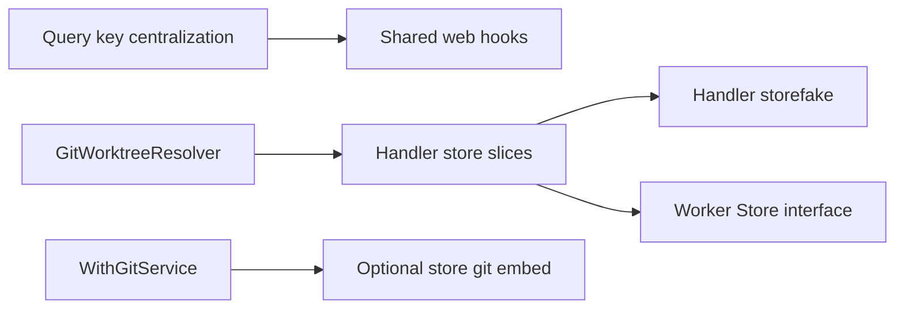

# Abstractions and interfaces audit — ROI-ranked findings

> Generated by abstractions audit (umbrella plan). Read-only audit; no code changed.

## Summary

- Items found: 12 (High: 4, Medium: 6, Low: 2)
- Top 3 by ROI:
  1. Centralize settings runner/model query keys (drift causes stale UI after SSE)
  2. Handler `*store.Store` → composed store interfaces (follow harness `contract.Store`)
  3. Task query-key gaps (`detailRoot`, infinite events prefix)

## ROI legend

| Score | Effort | Risk | Typical action |
| --- | --- | --- | --- |
| 8–10 | ≤1 day | Low | Do next sprint |
| 5–7 | 1–3 days | Medium | Batch with related work |
| 1–4 | >3 days or high risk | Defer or spike first |

**Formula:** `(maintainability_gain × blast_radius) / (effort × risk)` — scores are rounded 1–10.

---

## Findings (ranked)

### 1. Centralize settings runner/model query keys — ROI 9/10 (High)

- **Location:** `web/src/settings/settingsQueryKeys.ts` (only `app()`); inline keys in `SettingsPage.tsx` (~L257–291), `TaskCreateModalAgentSection.tsx` (~L76–83)
- **Issue:** Cursor-model list queries use ad-hoc `["settings", "cursor-models", …]` shapes duplicated across settings and task create modal; SSE invalidation can miss keys.
- **Proposed change:** Extend `settingsQueryKeys`: `cursorModels(runner, binaryPath)`, `verifyModels(runner, binaryPath)`.
- **Effort / risk / blast radius:** Low (~1 file + 3 call sites); low risk; settings page, create modal, SSE tests.
- **Evidence:** Pattern exists in `taskQueryKeys.ts`, `gitQueryKeys.ts`, `projectQueryKeys.ts`.

### 2. Handler `*store.Store` → composed store interface — ROI 9/10 (High)

- **Location:** `pkgs/tasks/handler/handler.go` (`store *store.Store`); ~120 `h.store.*` calls across ~25 handler files; wiring in `internal/taskapi/http.go`
- **Issue:** Handlers depend on full ~130-method GORM facade. Harness already uses narrow `contract.Store`; HTTP layer does not.
- **Proposed change:** New `pkgs/tasks/contract` with composed interfaces: `TaskCRUDStore`, `CycleStore`, `ProjectStore`, `GitInventoryStore`, `TemplateStore`, `DraftStore`, `SettingsReader`. Incremental: one resource group per PR.
- **Effort / risk / blast radius:** High if at once; medium incremental; medium risk (interface drift); all handlers + taskapi.
- **Evidence:** `pkgs/agents/harness/internal/contract/store.go` + compile check in `store_assert_test.go`.

### 3. Task query-key gaps (`detailRoot`, infinite events) — ROI 8/10 (High)

- **Location:** `web/src/tasks/sync/decideFlushBatch.ts` (L28), `useTaskDetailEvents.ts` (L75–80), `TaskEventDetailPage.tsx`, `ProjectContextEntryCard.tsx`
- **Issue:** SSE flush uses prefix `[...taskQueryKeys.all, "detail"]` not exported from `taskQueryKeys`; infinite events key hand-built and can drift.
- **Proposed change:** `taskQueryKeys.detailRoot()`, `taskQueryKeys.eventsInfinite(taskId)`; optionally `projectQueryKeys.contextEntryMeta(projectId)`.
- **Effort / risk / blast radius:** Low effort; medium risk (wrong prefix = stale detail after SSE); sync layer + event stream tests.
- **Evidence:** `taskQueryKeys.ts` documents list-page dedup rationale but omits detail prefix.

### 4. `RepoProvider` → narrow `GitWorktreeResolver` — ROI 8/10 (High)

- **Location:** `pkgs/tasks/handler/repo_provider.go` — `settingsRepoProvider` holds `*store.Store`, calls only `GetGitWorktreeByID`
- **Issue:** Dynamic repo wiring pulls entire store monolith for one lookup.
- **Proposed change:** `type GitWorktreeResolver interface { GetGitWorktreeByID(ctx, id) (domain.GitWorktree, error) }`; `NewSettingsRepoProvider(r GitWorktreeResolver)`.
- **Effort / risk / blast radius:** Low; low risk; `repo_provider.go`, handler options, `internal/taskapi/http.go`.
- **Evidence:** Existing `RepoProvider` interface + `NewStaticRepoProvider` for tests.

### 5. Worker / reconcile accept `harness.Store` not `*store.Store` — ROI 8/10 (High)

- **Location:** `pkgs/agents/worker/worker.go`, `pool.go`, `reconcile.go`, `pickup_wake.go`, `sweep.go` — all `*store.Store`; harness already uses `Store` interface
- **Issue:** Asymmetric DIP — harness path is interface-driven; worker/reconcile still concrete, blocking lightweight fakes.
- **Proposed change:** Define `worker.Store` (or extend `harness.Store` with queue-specific reads: `ListReadyTaskQueueCandidates`, etc.).
- **Effort / risk / blast radius:** Medium; low–medium risk; `pkgs/agents/*`, `internal/taskapi/agentworker/`.
- **Evidence:** `pkgs/agents/harness/store.go` alias, `storefake/storefake.go`.

### 6. Shared `useCursorModels` hook — ROI 7/10 (Medium)

- **Location:** `SettingsPage.tsx` (`useSettingsCursorModelQueries`), `TaskCreateModalAgentSection.tsx` (inline `useQuery` + `listCursorModels`)
- **Issue:** Same API call and enablement logic duplicated; ties to query-key finding #1.
- **Proposed change:** `web/src/settings/hooks/useCursorModels.ts` exporting keyed query + `modelIdsFromList` helper.
- **Effort / risk / blast radius:** Low–medium; low risk; settings + create modal tests.
- **Evidence:** Pattern in `useAppSettings.ts`, `projects/hooks.ts`.

### 7. Shared `useDebouncedTrimmedValue` in `web/src/hooks/` — ROI 7/10 (Medium)

- **Location:** Local copies in `RepositoriesListPage.tsx`, `RepositoryWorktreesPage.tsx`; exported copy in `tasks/templates/templateUtils.ts`
- **Issue:** Identical debounce+trim hook duplicated 3×; CODE_STANDARDS expects shared hooks in `web/src/hooks/`.
- **Proposed change:** `web/src/hooks/useDebouncedTrimmedValue.ts`.
- **Effort / risk / blast radius:** Low; low risk; worktrees list pages, templates page.
- **Evidence:** Three identical hook implementations.

### 8. Handler-level store fake (after narrow interfaces) — ROI 7/10 (Medium)

- **Location:** Handler tests use `tasktestdb.OpenSQLite` everywhere; contrast `pkgs/agents/harness/storefake/`, `runnerfake/`, `fakeAgentControl` in settings contract tests
- **Issue:** No method-recording fake for error-path tests without DB seeding; every handler test pays full I/O.
- **Proposed change:** `pkgs/tasks/handler/storefake` or testify mock against `HandlerStore` slices from finding #2.
- **Effort / risk / blast radius:** Medium (depends on #2); low risk if scoped; handler test suite speed.
- **Evidence:** No handler store fake exists; harness has SQLite-backed + recording patterns.

### 9. `WithGitService(gitwork.Service)` on Handler — ROI 7/10 (Medium)

- **Location:** `handler.go` (field set to `gitwork.New()`); only test knob is `WithGitAvailable` in `pathmap.go`
- **Issue:** `gitwork.Service` is already an interface but handlers cannot inject a fake — git route tests hit real `git` or skip.
- **Proposed change:** `WithGitService(s gitwork.Service) HandlerOption`.
- **Effort / risk / blast radius:** Low; low risk; `handler_git_*.go`, git binding tests.
- **Evidence:** Pattern from `WithRepoProvider`, `WithAgentWorkerControl`.

### 10. Embed `gitwork.Service` in store git facade — ROI 6/10 (Medium)

- **Location:** `store_git_worktrees.go`, `store_git_branches.go`, `store_git_repositories.go`, `reconcile_git.go` — every mutator takes `gitSvc gitwork.Service` as last param
- **Issue:** Parameter drilling across store↔handler; easy to pass wrong/nil service in new endpoints.
- **Proposed change:** `Store` holds optional `gitSvc gitwork.Service` (set at construction); store methods drop param.
- **Effort / risk / blast radius:** Medium–high (~30 call sites); medium risk; all git store + handler routes.
- **Evidence:** Pattern from `SetReadyTaskNotifier` / `PickupWake` on `store.go`.

### 11. Move component `useQuery` to feature hooks — ROI 6/10 (Medium)

- **Location:** `TaskCreateModalAgentSection.tsx` imports `fetchAppSettings`, `listCursorModels` from `@/api/settings` and runs `useQuery` in presentational field
- **Issue:** CODE_STANDARDS: fetch in `api/`, queries in feature hooks; components receive data/callbacks.
- **Proposed change:** `useTaskCreateAgentOptions()` in `tasks/create/hooks/`; component takes `cursorModels`, `loading`, `onRunnerChange`.
- **Effort / risk / blast radius:** Low; low risk; create modal + tests.
- **Evidence:** Pattern in `useTaskCreateFlow.ts`, `useAppSettings.ts`.

### 12. Extend or split `contract.Store` for new domains — ROI 6/10 (Medium)

- **Location:** `pkgs/agents/harness/internal/contract/store.go` (71 methods); new surfaces: `facade_templates.go`, `store_git_*.go` not on contract
- **Issue:** Harness contract stays stable but HTTP/git/templates grow monolith without documented boundary.
- **Proposed change:** Keep harness contract narrow; add `pkgs/tasks/contract/http.go` for handler slices with separate fakes.
- **Effort / risk / blast radius:** Medium per domain; low risk if HTTP contract separate from harness; templates UI/API.
- **Evidence:** `storefake` only proves harness contract today.

---

## Honorable mentions (ROI 4–5)

| Item | Location | Note |
| --- | --- | --- |
| Runner registry injectable interface | `pkgs/agents/runner/registry/` | Low pain today (one runner) |
| Observability query key module | `observability/useSystemHealth.ts` | Trivial `observability/queryKeys.ts` polish |
| Harness `GitRepo` | `harness/internal/git/git_exec.go` | Already minimal (`Run` only) |

## Suggested sequencing

**Quick wins (1–2 sessions):** #1, #3, #4, #6, #7, #9, #11  
**Structural (multi-PR):** #2 → #8, #5, #12  
**Defer unless git churn is high:** #10

## Patterns to copy

| Pattern | Location | Reuse for |
| --- | --- | --- |
| `contract.Store` | `harness/internal/contract/store.go` | Handler/worker store slices |
| `storefake` + compile assert | `harness/storefake/`, `store_assert_test.go` | Handler fakes |
| `RepoProvider` | `handler/repo_provider.go` | Git worktree resolver |
| `AgentWorkerControl` | `handler/handler.go` | Narrow handler deps |
| `taskQueryKeys` | `web/src/lib/taskQueryKeys.ts` | Settings/git/observability keys |
