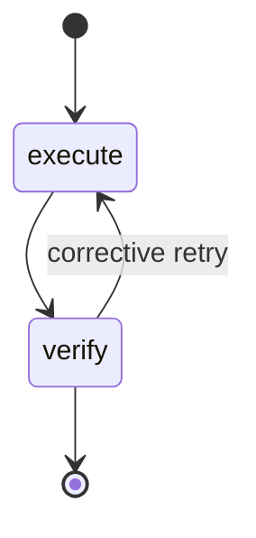
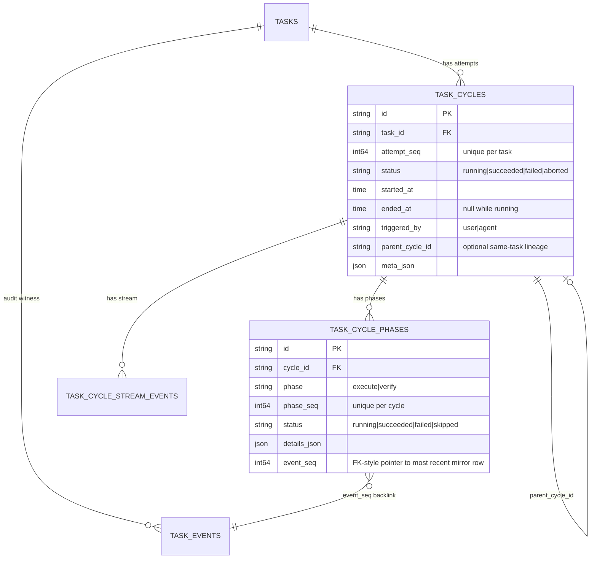
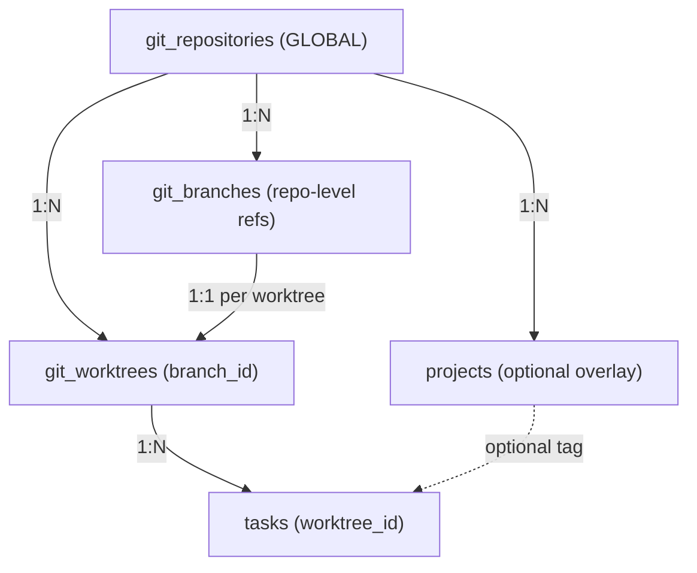

# Data model

Tasks, projects, execution cycles/phases, checklists, dependencies, and gates. HTTP shapes are in [api.md](./api.md); how the worker drives this substrate is in [architecture.md](./architecture.md).

## Project → Task

Work hierarchy is **Project → Task**. Tasks may have:

- `project_id` (required for agent runs) — shared-context membership. Every task with a `worktree_id` must reference a project whose `repository_id` matches that worktree's repo. Use the repo's system default project when no custom grouping is needed. See [ADR-0042](./adr/ADR-0042-repo-default-projects.md).
- `tags` and `milestone` — flat labels for organization within a project.
- `depends_on` — directed acyclic graph of task-level dependencies.

`project_id` answers "which long-running body of work shares context with this task?" A project is not a task parent. Multi-step work is modeled as sibling tasks linked by `depends_on`. See [adr/ADR-0010-remove-subtasks.md](./adr/ADR-0010-remove-subtasks.md).

## Task fields

| Field | Type | Notes |
|---|---|---|
| `id` | string (UUID) | Server-assigned when omitted. |
| `title` | string | Required after trim. |
| `initial_prompt` | string (HTML) | TipTap rich text; `@`-mentions validated against the task's `worktree_id` when present. |
| `worktree_id` | string \| null | FK to `git_worktrees.id`; set by server allocate on create from `repository_id` (ADR-0081). |
| `status` | enum | `ready` / `running` / `blocked` / `review` / `done` / `failed` / `on_hold` / `closed`. Default `ready`. After successful agent execute+verify the task enters **`review`** (awaiting human approval). Only `POST /tasks/{id}/approve` may set **`done`**. `on_hold` is operator-set: pickup is gated on `status = ready` so an `on_hold` task is intentionally kept out of the worker's queue until the operator flips it back to `ready` (PATCH `/tasks/{id}`). **`closed`** is the operator exit that replaces hard delete: set only via `POST /tasks/{id}/close` (idempotent); reopen with `POST /tasks/{id}/reopen` → `ready`. Closed tasks are not worker-eligible. A closed predecessor does **not** satisfy `depends_on` edges (same as `on_hold`/`failed`). |
| `pending_retry` | JSON \| null | Ephemeral operator intent between `POST /tasks/{id}/retry` or `POST /tasks/{id}/polish` and worker pickup. `{ kind?: retry|polish, mode: fresh|resume, parent_cycle_id, instructions? }`. Empty/omitted `kind` means `retry` (back-compat). Polish always uses `mode=resume` with non-empty `instructions`. Not exposed on the HTTP task JSON (`json:"-"`); consumed and cleared atomically when the worker transitions `ready→running`. |
| `priority` | enum | `low` / `medium` / `high` / `critical`. Required at create. |
| `project_id` | string \| null | Project membership. Required on create when `worktree_id` is set; must belong to the same repo as the worktree. |
| `number` | int \| null | Per-project sequential display ref (`#N`). Assigned when `project_id` is set; immutable. Clearing or changing `project_id` on a numbered task is rejected. Null when the task has no project. |
| `tags` | string[] | Free-form, stored lowercase `^[a-z0-9][a-z0-9._-]{0,31}$`. Create/PATCH lowercases before validate. |
| `milestone` | string \| null | Single anchor per task, `^[a-zA-Z0-9][a-zA-Z0-9 ._-]{0,63}$` when set. |
| `depends_on` | object[] | Hydrated from `task_dependencies`: `{ task_id, satisfies }` where `satisfies` is `done` (default and only value). |
| `criteria_satisfied_at` | RFC3339 UTC \| null | Set when all checklist items are verified complete; informational cache on the task row (dependency edges use predecessor `status = done`). |
| `gate` | object \| null | Per-task dequeue pause (see below). |
| `pickup_not_before` | RFC3339 UTC \| null | Defer when the worker may dequeue. |
| `cursor_model` | string | Optional model override at runtime. |
| `created_at` | RFC3339 UTC | Hydrated from the seq=1 `task_created` audit event on read. Omitted when unknown. |

`GET /tasks` returns tasks **newest first** (`task_created` time descending, then `id` descending). Other timestamps remain on `task_events`.

## Dependencies

- Storage: `task_dependencies(task_id, depends_on_task_id, satisfies)` with FK cascade. `satisfies` is `done` (default when omitted).
- A task in `ready` is worker-eligible only when every predecessor has `status = done`.
- Unblocking a predecessor (reach `done`) notifies dependents whose edges are now satisfied.
- Self-deps and cycles return `400 invalid input`.
- API: incremental via `GET/POST/DELETE /tasks/{id}/dependencies`; full replace via `depends_on` on `PATCH /tasks/{id}`. Wire format accepts legacy `string[]` (each id maps to `satisfies: done`) or structured `{ task_id, satisfies }[]`.

Predecessors must reach `status = done`. A predecessor in `failed` or `on_hold` keeps dependents blocked until the operator fixes status or edits dependencies.

## Gate

```json
{
  "kind": "manual_approval",
  "status": "locked | active | pending_release | released",
  "hold": false,
  "pending_release_deadline_utc": "RFC3339 optional",
  "criteria": []
}
```

- Worker dequeue requires `gate IS NULL` OR `gate.status = released`.
- Operator actions: `PATCH /tasks/{id}/gate` with `action ∈ release | hold | clear_hold`.
- Auto-release after grace deadline is **not** implemented; release is operator-driven.

## Worker readiness (all must pass)

1. `status = ready`
2. `pickup_not_before` is null or `<= now()`
3. All `depends_on` predecessors have `status = done`
4. `gate` is null or `gate.status = released`

If a task is dequeued but fails (3) or (4) on reload, the worker sets `pickup_not_before` ~60s ahead and skips the run.

## Scheduling (`pickup_not_before`)

`domain.Task.PickupNotBefore *time.Time` → indexed column `pickup_not_before`. `nil` means "pick up as soon as the worker is free".

- Wire format: RFC3339 UTC string. JSON `null` on `PATCH` clears the field. Empty string is rejected on `POST` (`400`).
- Default deferral on create: `app_settings.agent_pickup_delay_seconds` applies when creating `status=ready` and the client omits `pickup_not_before`.
- Eligibility predicate: `status='ready' AND (pickup_not_before IS NULL OR pickup_not_before <= now())` — see `pkgs/tasks/store/internal/ready/ready.go` (`ListQueueCandidates`). Deep dives: [domain/task-scheduling.md](domain/task-scheduling.md) (four readiness predicates), [domain/agent-queue.md](domain/agent-queue.md) (in-memory queue).
- Three paths to the worker: immediate notify on commit, `PickupWakeScheduler` for future times, reconcile (2m tick) as backstop. **Invariant:** the in-memory queue never contains a task the SQL predicate would reject.
- Single-process: `MemoryQueue` and `PickupWakeScheduler` are not shared across replicas. Keep NTP aligned on app hosts and Postgres so process and DB clocks agree.

## Execution cycles and phases

```text
Task -> many cycles (attempts) -> many phases (steps in an attempt)
```

A **cycle** is one execution attempt. Cycles live in `task_cycles` and are ordered per task by `attempt_seq` (positive integer, `max + 1` assigned by the store inside the same transaction as the insert).

A **phase** is one step inside a cycle. Phases live in `task_cycle_phases` and are ordered per cycle by `phase_seq`. The path is `execute → verify`, with `verify → execute` allowed for corrective retries. A cycle may repeat phase kinds — each visit is a separate row with a higher `phase_seq`.



`domain.ValidPhaseTransition(prev, next)` defines the graph. Reaching the end of the phase graph is not the same as terminating the cycle — the caller still has to `TerminateCycle(succeeded|failed|aborted)`.

### Schema



### Store invariants

- `(task_id, attempt_seq)` and `(cycle_id, phase_seq)` are unique. Stores assign `max + 1` in the same transaction.
- `task_cycles.task_id` and `task_cycle_phases.cycle_id` are FK with `ON DELETE CASCADE`.
- At most one running cycle per task. `StartCycle` rejects with `ErrInvalidInput: task already has a running cycle`.
- At most one running phase per cycle. `StartPhase` rejects with `ErrInvalidInput: cycle already has a running phase`.
- Terminal rows are read-only. Corrective work means a new row with a higher seq.
- Cross-task lineage is rejected. `parent_cycle_id` must reference a cycle on the same task.
- `meta_json` and `details_json` are `jsonb` (Postgres) / `text` (SQLite) and default to `{}`.
- Execute and verify phase `details_json` may include a top-level Cursor `usage` object (`inputTokens`, `outputTokens`, `cacheReadTokens`, `cacheWriteTokens`, `totalTokens` — camelCase per ADR-0083). The harness persists it from the runner `Result` on both phase kinds; verify shallow-merges usage alongside the verification snapshot. Absent or unparseable usage is omitted from server-side aggregates (`taskcycles/domain.TokenUsage`, `ListPhaseTokenUsageForTask`).

### Dual-write invariant

Every cycle/phase mutation appends a mirror row to `task_events` **inside the same `gorm.DB` transaction**. If the mirror append fails, the cycle/phase row is rolled back.

| Store entrypoint | Cycle/phase write | Mirror `task_events.type` |
|---|---|---|
| `StartCycle` | insert `task_cycles` (`status=running`) | `cycle_started` |
| `TerminateCycle(succeeded)` | update to terminal | `cycle_completed` |
| `TerminateCycle(failed|aborted)` | update to terminal | `cycle_failed` (status preserved in payload) |
| `StartPhase` | insert `task_cycle_phases` (`status=running`) | `phase_started` |
| `CompletePhase(succeeded|failed|skipped)` | update to terminal | `phase_completed` / `phase_failed` / `phase_skipped` |

`StartPhase` and `CompletePhase` capture the assigned `task_events.seq` and write it back into `task_cycle_phases.event_seq` in the same transaction. The pointer is one-shot: `CompletePhase` overwrites the `StartPhase` value with the terminal mirror seq.

Mirror rows are non-interactive: `PATCH /tasks/{id}/events/{seq}` returns `400` for these seven types because the cycle/phase row is the system of record.

### Cycle metadata (`meta_json` / `cycle_meta`)

`task_cycles.meta_json` is an adapter-facing sidecar — opaque to the store, contract-defined by the runner. The agent worker writes a stable five-key payload at `StartCycle`:

```json
{
  "runner": "cursor",
  "runner_version": "2.x.y",
  "cursor_model": "",
  "cursor_model_effective": "opus-4",
  "prompt_hash": "sha256:abc123…"
}
```

| Key | Meaning |
|---|---|
| `runner` | `runner.Runner.Name()` at cycle start (e.g. `"cursor"`). |
| `runner_version` | `runner.Runner.Version()` at cycle start. |
| `cursor_model` | Operator intent (verbatim `tasks.cursor_model`). |
| `cursor_model_effective` | Model the runner will actually execute against — audit truth. |
| `prompt_hash` | `sha256` of the prompt string. Never the body. |

Keys are additive only; consumers must ignore unknown keys. Values are always strings (empty string = "no value"). The API surfaces a typed projection `cycle_meta` on `/tasks/{id}/cycles[/{cycleId}]` so the SPA does not re-parse the raw JSON.

### Where reads go

| Question | Read from |
|---|---|
| What's the current attempt for this task? | `task_cycles` (`status=running`, latest `attempt_seq`). |
| List all attempts for this task. | `GET /tasks/{id}/cycles`. |
| What phase is the current cycle in? | `GET /tasks/{id}/cycles/{cycleId}` (`phases[]`, `phase_seq ASC`). |
| Audit history (everything that happened, in order). | `GET /tasks/{id}/events`. |
| Cursor live-update history for one attempt. | `GET /tasks/{id}/cycles/{cycleId}/stream`. |
| Did anything change for this cycle (live UI hint)? | SSE `task_cycle_changed` (`id` = task, `cycle_id` = cycle). |

## Checklist (done criteria)

Behavioral deep-dives: [domain/harness.md](./domain/harness.md) (orchestration), [domain/done-criteria.md](./domain/done-criteria.md) (full lifecycle), [domain/execute-agent.md](./domain/execute-agent.md) (execute phase), [domain/verify-agent.md](./domain/verify-agent.md) (verify phase), [domain/persistence.md](./domain/persistence.md) (dual-write), [domain/task-events.md](./domain/task-events.md) (audit log).

Per-task acceptance requirements. Stored in `task_checklist_items` (definitions: `id`, `task_id`, `sort_order`, `text`) and optional `task_checklist_item_commands` (per-criterion shell checks: `item_id`, `sort_order`, `command`, `expected_outcome`, optional `timeout_seconds`, `ON DELETE CASCADE`) and `task_checklist_completions` (per-subject ledger: `task_id`, `item_id`, `at`, `done_by`, `evidence`, `verified_by`, `verifier_reasoning`, `cycle_id`). Operators attach zero or more verification commands per criterion; during verify the worker runs them in the task worktree, writes stdout/stderr/meta under the worker-managed report dir, and feeds those artifacts to the execute agent in the verify phase for command-backed criteria. Criteria **without** verify commands are accepted from the execute self-claim when `claimed_done: true` (`verified_by=execute_claim`, [ADR-0090](adr/ADR-0090-command-only-verify.md)). Optional `timeout_seconds` (> 0) caps that command; omit/null means no wall-clock timeout. The LLM remains the sole authority for command-backed criteria — exit code 0 does not auto-pass.

**Create:** `POST /tasks` requires at least one non-empty done criterion in `checklist_items`; definition rows are inserted in the same transaction as the task row.

**Completion:** Marking a task `done` requires its checklist to be complete when criteria exist. Execution order among related tasks is expressed only via `depends_on` (see Dependencies).

**Definition edits:** Operators may add checklist definition rows only while the task is not `running` or `done`. Once the agent has picked up the task, criteria are locked; edit and delete remain subject to the existing cycle-running and verified-item guards documented in [api.md](./api.md).

| `verified_by` value | Meaning |
|---|---|
| `agent_self` | Failure-only: execute did not claim done in the criteria report. Never written on success. |
| `execute_agent` | Verify phase accepted command-backed criterion (sole authority for marking done). |
| `execute_claim` | Harness accepted execute self-claim for claim-only criterion ([ADR-0090](adr/ADR-0090-command-only-verify.md)). |
| `verify_agent` | Legacy wire value; superseded by `execute_agent` ([ADR-0084](adr/ADR-0084-executor-owned-verify.md)). |
| `deterministic_check` | Legacy rows only (pre–verify-only migration); never written by the current worker. |
| `human_override` | Reserved; schema only. |
| `legacy` | Pre-V1.1 rows backfilled at migrate; never written by the new worker. |

### Edit locks

| State | Add | Edit text | Delete | Agent mark done |
|---|---|---|---|---|
| Open (no running cycle) | yes | yes | yes* | yes |
| Cycle running | no (409) | no (409) | no (409) | yes |
| Verified (completion exists) | yes | no (409) | no (409) | yes |

\*Delete blocked if any subject has marked the item done.

### Worker verification loop

Verify runs after every successful execute when the task has at least one criterion. Tasks with **zero criteria** (legacy rows created before the create-time requirement) skip verify and write no checklist completion rows — a successful execute alone marks the task `review` (awaiting human approval via `POST /tasks/{id}/approve`).

1. **Execute** — prompt prepends all criteria with stable ids and the **absolute** worker-managed path the agent must write its report to (`<worker-managed dir>/<cycle_id>/criteria-report.json`, see "Report file contracts" below). `claimed_done` in the report is an assertion only — not final acceptance.
2. **Gate** — criteria with `claimed_done: false` fail immediately (`verified_by=agent_self`); no verify pass for those ids.
3. **Claim-only** — criteria with `claimed_done: true` and no `verify_commands` are accepted from the execute report (`verified_by=execute_claim`); no PhaseVerify Cursor run.
4. **Command-backed verify** — for criteria with `verify_commands`, the worker runs shell checks, then the **same execute runner** runs `PhaseVerify` in the execute working dir and writes its verdict to the **absolute** worker-managed `<worker-managed dir>/<cycle_id>/verify-report.json` path. The agent MUST NOT modify any path inside the working dir during verify. The worker enforces this with a pre/post integrity snapshot of `git status --porcelain` plus `git rev-parse HEAD`; the whitelist is empty (report files live outside the working tree, so any porcelain diff is tampering), any HEAD movement, or any failure to capture the post-snapshot terminates the cycle as `verify_tampered` (terminal — no completion rows). When the working dir is not a git repo, the integrity check is bypassed and logged once at startup. Successful command-backed criteria are marked `verified_by=execute_agent`. On `CompletePhase`, verify phases also write a structured `details.verification` snapshot (attempt seq, pass/fail counts, per-criterion text/reasoning) into the mirrored `phase_completed` / `phase_failed` audit event so the SPA audit timeline and event detail page can explain outcomes without a verdicts round-trip.
5. **Decision** — all pass → atomic `SetDoneWithEvidence` + `status=done`; any fail → terminate with reason `verification_failed:<id>,<id>,…` (sorted, deduped failing criterion IDs after the prefix) and **no** completion rows. One-shot per cycle ([ADR-0090](adr/ADR-0090-command-only-verify.md)); operators recover via Retry / Start over. The `verification_failed` prefix is contract-stable; consumers MUST use prefix matching (`startsWith`). Bare `verification_failed` (older cycles) remains a valid value. The reason column is 256 chars; long failure lists are truncated with a trailing `…` while keeping the prefix intact.

Pre-V1.1 completion rows may carry `verified_by=legacy` (backfilled at migrate); the current worker never writes that value.

### Report file contracts

Paths live under a **worker-managed scratch directory** (`<worker-managed dir>/<cycle_id>/...`) which the operator never sees. The worker resolves the directory from `HAMIX_WORKER_REPORT_DIR` (default `<os.TempDir()>/hamix-worker`); the agent CLI is told the absolute path in its prompt and writes there directly. The directory lives outside `app_settings.repo_root` so customer working trees stay clean and the verify-pass integrity check has an empty whitelist (any porcelain diff against the working tree during verify is tampering). The per-cycle subdirectory is GC'd by the worker at cycle terminate so disk use stays bounded.

| File | Writer | Schema |
|---|---|---|
| `<worker-managed dir>/<cycle_id>/criteria-report.json` | Execute agent | `{ "criteria": [{ "id", "claimed_done", "evidence" }], "commits": [{ "sha", "branch" }] }` — `commits` optional; worker validates SHAs against git ancestry at execute ingest ([ADR-0014](adr/ADR-0014-cycle-commit-tracking.md), [domain/cycle-commits.md](domain/cycle-commits.md)) |
| `<worker-managed dir>/<cycle_id>/verify-report.json` | Execute agent (verify phase) | `{ "criteria": [{ "id", "verified", "reasoning" }] }` |

Limits: 256 KB per report file; `evidence` and `reasoning` ≤ 16 KB each; verify `reasoning` ≥ 40 chars when `verified=true`. Duplicate ids in a report → invalid. Symlinks rejected.

### Verdict tables

The two report files above are the agent ↔ worker wire format. They are GC'd at cycle terminate, so they are NOT the durable record. The worker mirrors each parsed report into one row per criterion per attempt in two normalized tables. These rows are the source of truth for the SPA's verdict UI and for support / prompt-tuning analytics.

`task_cycle_criteria_reports`

| Column | Type | Notes |
|---|---|---|
| `id` | uuid pk | server-assigned at upsert. |
| `cycle_id` | string fk → `task_cycles.id` (`ON DELETE CASCADE`) | indexed; verdicts disappear with their cycle. |
| `attempt_seq` | int (>0) | which retry attempt produced this row. |
| `criterion_id` | string fk → `task_checklist_items.id` (`ON DELETE NO ACTION`) | non-cascade preserves verdict history if an operator deletes a criterion later. |
| `claimed_done` | bool | execute agent's self-claim from `criteria-report.json`. |
| `evidence` | text (≤ 16 KB at the boundary) | mirrored from the file. |
| `written_at` | timestamptz | indexed. |

`task_cycle_verify_reports`

| Column | Type | Notes |
|---|---|---|
| `id` | uuid pk | server-assigned. |
| `cycle_id` | string fk → `task_cycles.id` (`ON DELETE CASCADE`) | indexed. |
| `attempt_seq` | int (>0) | retry attempt. |
| `criterion_id` | string fk → `task_checklist_items.id` (`ON DELETE NO ACTION`) | history preserved on criterion delete. |
| `verified` | bool | per-criterion verdict for this attempt. |
| `verifier_kind` | string | one of `domain.VerifierKind` (`agent_self` / `execute_agent` / `verify_agent` / `deterministic_check` / `human_override` / `legacy`); same enum as `task_checklist_completions.verified_by` so the SPA can render the same chip in both surfaces. `execute_agent` is current; `verify_agent` is legacy. |
| `reasoning` | text (≤ 16 KB) | verifier rationale. |
| `written_at` | timestamptz | indexed. |

`task_cycle_commits`

Worker-indexed git commits for one cycle ([ADR-0014](adr/ADR-0014-cycle-commit-tracking.md), [ADR-0032](adr/ADR-0032-agent-claimed-commit-index.md)). Upserted after a successful execute run from agent-declared `commits[]` in `criteria-report.json`. Not dual-written to `task_events`.

| Column | Type | Notes |
|---|---|---|
| `id` | uuid pk | server-assigned at upsert. |
| `task_id` | string fk → `tasks.id` (`ON DELETE CASCADE`) | denormalized for list-by-task. |
| `cycle_id` | string fk → `task_cycles.id` (`ON DELETE CASCADE`) | indexed. |
| `phase_seq` | int (>0) | execute phase that ingested this SHA. |
| `seq` | int (>0) | order within ingest batch; unique index with `cycle_id` for ordering. |
| `repo` | text | `app_settings.repo_root` at snapshot. |
| `worktree` | text | `git rev-parse --show-toplevel`. |
| `branch` | string | from agent report, `git branch --contains`, or snapshot `base_branch`. |
| `sha` | string | full commit hash; unique with `cycle_id`. |
| `committed_at` | timestamptz | from `git log -1`. |
| `message` | text | subject line from `git log -1`. |
| `recorded_at` | timestamptz | worker ingest time. |

Unique index: `(cycle_id, sha)`. List order: `seq ASC`. Pre-ADR-0014 cycles return zero rows.

`task_cycle_command_runs`

| Column | Type | Notes |
|---|---|---|
| `id` | uuid pk | server-assigned. |
| `cycle_id` | string fk → `task_cycles.id` (`ON DELETE CASCADE`) | indexed. |
| `attempt_seq` | int (>0) | verify attempt that ran the command. |
| `criterion_id` | string fk → `task_checklist_items.id` (`ON DELETE NO ACTION`) | which criterion owned the command. |
| `command_seq` | int (≥0) | `sort_order` from `task_checklist_item_commands`. |
| `exit_code` | int | process exit code (`-1` when start/wait failed). |
| `meta_path` | text | absolute path to `<report_dir>/<cycle_id>/checks/<criterion_id>/<seq>.meta.json`. |
| `written_at` | timestamptz | indexed. |

Stdout/stderr bytes live only in temp files under the worker report dir (see `<worker-managed dir>/<cycle_id>/checks/...`); this table is the durable audit index for the SPA timeline.

Both verdict tables enforce a composite unique index on `(cycle_id, attempt_seq, criterion_id)`. Command runs enforce `(cycle_id, attempt_seq, criterion_id, command_seq)`.

Pre-PR2 cycles return zero rows from these tables; the handler returns empty arrays, never 404. Cleanup is FK-driven: deleting a cycle (which itself cascades from task deletion) cascades to the verdict rows; `criterion_id` is intentionally `NO ACTION` so that historical cycles remain readable after a checklist edit.

## Task templates (`task_templates`)

Named, durable compose blueprints — same field set as task create JSON (without runtime-only `id`, `draft_id`, `gate`). Distinct from `task_drafts` (ephemeral autosave, deleted on task submit) and from executable `tasks`.

| Column | Type | Notes |
|---|---|---|
| `id` | string pk (UUID) | Server-assigned when omitted on save. |
| `name` | string | Display + search key; defaults to trimmed `payload.title` at save. |
| `payload_json` | jsonb | `TaskComposePayload` — title, prompt, status, priority, checklist, runner, project, schedule, tags, milestone, `depends_on`, optional template-only `function_inputs` ([ADR-0088](./adr/ADR-0088-template-functions.md)). |
| `created_at` | timestamptz | indexed. |
| `updated_at` | timestamptz | indexed; list order DESC. |

Instantiate (`POST /task-templates/instantiate`) maps payload → `POST /tasks` via the shared compose pipeline: `depends_on` stripped (stale UUIDs); past `pickup_not_before` omitted; no draft row linkage.

## Projects

Projects are repo-bound containers for tasks (`project_id`, per-project `#N`, system default per repository). Project memory tables (`project_context_items`, `project_context_edges`, `task_context_snapshots`) and `projects.context_summary` were removed — see [ADR-0087](./adr/ADR-0087-remove-project-context.md).

## Git workflow (`git_repositories`, `git_worktrees`, `git_branches`)

Git context chain: **repo → managed worktree (`branch_id`) → task (`worktree_id`)**. Operators register a repository by path; task create with `repository_id` allocates a worktree under `{UserConfigDir}/hamix/worktrees/{repoID}/…` (override `HAMIX_MANAGED_WORKTREE_ROOT`; see [ADR-0081](./adr/ADR-0081-hamix-managed-worktrees.md)). A **project** is an optional overlay tied to one repo. Also [ADR-0039](./adr/ADR-0039-fixed-worktree-branch.md), [ADR-0037](./adr/ADR-0037-global-repos-project-tree.md), [domain/worktrees-and-branches.md](./domain/worktrees-and-branches.md).



### `git_repositories`

Global. One row per git object database (`git_common_dir`). Not owned by a project.

| Column | Type | Notes |
|---|---|---|
| `id` | uuid pk | Server-assigned. |
| `path` | text | Absolute path to the **main** worktree checkout. **Unique globally.** Normalized from any linked checkout at register time. |
| `git_common_dir` | text | Shared git directory from `git rev-parse --git-common-dir`. **Unique globally.** |
| `host_path` | text | Optional display path when it differs from `path` (e.g. symlink or alternate view). |
| `default_branch` | string | Deprecated; retained for schema compatibility. Not shown in UI. |
| `created_at` / `updated_at` | timestamptz | |

### `git_worktrees`

Belong to the repo only (no `project_id`).

| Column | Type | Notes |
|---|---|---|
| `id` | uuid pk | |
| `repository_id` | string fk -> `git_repositories.id` | |
| `path` | text | Working directory (main checkout or linked worktree). |
| `name` | string | Operator label. |
| `is_main` | bool | True for the registered main checkout row. |
| `branch_id` | string fk -> `git_branches.id` | Fixed branch for this worktree; immutable after create. **Unique** — each branch binds to at most one worktree. |
| `created_at` | timestamptz | |

### `git_branches`

Repo-level refs.

| Column | Type | Notes |
|---|---|---|
| `id` | uuid pk | |
| `repository_id` | string fk | |
| `name` | string | Branch name. |
| `head_sha` | string | Cached tip SHA (reconcile refreshes). |
| `created_at` | timestamptz | |

Tasks reference `worktree_id` (FK -> `git_worktrees.id`, required for agent runs) and `project_id` (required when `worktree_id` is set). `project.repository_id` must equal the worktree's repo. Delete returns **409** `has_running_task` when a **running** task targets the repo, worktree, or branch; allocating a worktree on a branch already bound elsewhere returns **409** `branch_bound_to_worktree`.

### `projects` (git overlay fields)

| Column | Type | Notes |
|---|---|---|
| `repository_id` | string fk -> `git_repositories.id` | Required for all projects except legacy rows removed by migration. |
| `is_default` | bool | System-seeded default for the repo; at most one per `repository_id`. Non-deletable. |

When a repository is registered (`POST /git/repositories`), the system creates a default project (`name: "Default"`, `is_default: true`) for that repo. Users create additional projects via `POST /projects` with `repository_id`. See [ADR-0042](./adr/ADR-0042-repo-default-projects.md).

## Audit log (`task_events`)

Append-only. Event type strings are `domain.EventType` values (`task_created`, `status_changed`, `prompt_appended`, `message_added`, checklist events, `on_task_done`, etc., plus the seven cycle/phase mirror types listed above). Per-task monotonic `seq`. Used for history and debugging; events are not replayed into the SSE hub.

`on_task_done` payload (emitted when the harness marks a task `done`): `{ "worktree_id", "commits": [{ "sha", "message", ... }] }` — foundation for future PR automation; no UI in v0.1.
