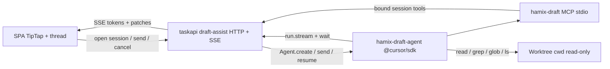

# Task draft AI — initial design

In-editor LLM help while composing a task, so operators polish the brief **inside Hamix** instead of copying between chat tools.

**v1 is prompt-box only.** Trigger, thread, and writes all live on the TipTap prompt in the create/edit **compose page** (`#task-new-prompt` / `RichPromptEditor`). The rest of the create form (title, priority, criteria, tags, assignment) is later expansion: same session and MCP host, more tools, no second agent.

This is **not** an execute/verify cycle. The existing Cursor CLI runner (`cursor-agent` via `pkgs/agents/runner/cursor`) stays as-is for worktree runs.

## Goal

A durable, multi-turn agent on the prompt editor. The user asks questions and iterates on the brief; the agent patches **prompt HTML** through MCP. They hit **Create** themselves.

Later, the same agent grows to the whole create component (title, priority, criterion, …) by adding tools — not by changing the runtime.

## UX

### Empty-line affordance

Placeholder and Space-for-AI are **only** valid at the start of an empty block (empty paragraph, cursor offset 0). Mid-line Space is a normal space. A line with any text never shows the hint.

Copy (empty block only): `Press Space for AI or / for commands`

TipTap: `Placeholder` with `showOnlyCurrent: true` plus a `placeholder` function that returns that string only for the focused empty paragraph. Space is a keymap that `preventDefault`s when the parent block is empty — it must not insert a space character.

`/` on the same empty-line condition opens a **local** slash menu (no LLM): heading, list, quote, `@` file mention, insert template. `/ai` is an alias for Space.

### Collaboration chrome

Space opens an **inline composer** anchored to that line (Notion-style). The first send also opens a **draft-assist thread** docked in the prompt section of the compose page.

| User does | Agent does |
| --- | --- |
| Ask (“what files should I @-mention?”) | Answers in the thread; may call read-only MCP |
| Request help (“tighten this into an execute brief”) | Patches the **prompt** via MCP; the editor updates in place |
| Keep editing the prompt | Follow-up `agent.send` still has the latest snapshot |
| Close the page | Agent is disposed |

Streaming assistant text appears in the thread. Prompt mutations apply in the editor — not as a blob the user must paste. v1 does not write title, priority, or criteria.

Escape / empty composer: close the inline box, leave the empty line as-is. Cancel stops the in-flight `run` when `run.supports("cancel")`.

## Runtime: Cursor SDK, not CLI

Host is a **Node sidecar** (`hamix-draft-agent`) using `@cursor/sdk`. `taskapi` does not shell out to `cursor-agent` for this feature.

Pattern: **`Agent.create` + `agent.send`** (multi-turn). Not `Agent.prompt` (one-shot).

```ts
await using agent = await Agent.create({
  apiKey, // CURSOR_API_KEY or Settings — never the CLI binary path
  model: { id: modelFromComposeModal ?? "composer-2.5" },
  local: { cwd: worktreeAbsPath }, // explicit local; do not default-by-omission
  mcpServers: { "hamix-draft": hamixDraftStdio },
  tools: ["read", "grep", "glob", "ls", "mcp"],
  disallowedTools: ["shell", "edit", "task"],
});
```

| Rule | Why |
| --- | --- |
| Local runtime, `cwd` = selected worktree | Read the repo the task will run in |
| `settingSources` omitted (inline MCP only) | Do not load the operator’s IDE MCP / hooks |
| No Shell / Edit / subagents | Drafting must not mutate the worktree or spawn extra agents |
| Re-pass `mcpServers` on `Agent.resume` | Inline MCP is not persisted |
| `await using` / `close()` on page leave | Avoid leaked local executors |
| Distinguish `CursorAgentError` vs `result.status === "error"` | Startup vs run failure |

Cloud runtime is out of v1 (no live worktree, higher latency for a chat loop).

## Architecture



The SDK cannot run in the browser. Go cannot import `@cursor/sdk`. Sidecar is the runner; `taskapi` owns session bind, auth, and SSE to the SPA.

Session starts lazily on first Space. One agent per open compose page. Autosaved drafts may store `draft_assist_agent_id` so a later resume of the same draft can `Agent.resume` (MCP servers passed again).

## MCP-first contract

Freeform model text is for the **thread**. Anything that changes Hamix state goes through **hamix-draft** tools (same idea as execute/verify tool-only reports in [agent-mcp.md](../domain/agent-mcp.md)). Do not reuse `hamix.commit` / `hamix.submit_*` / `hamix.create_pull_request`.

Bind: per-session nonce + draft/form id, same spirit as `agent-tool-bind.json`. Tools fail closed if the nonce does not match.

**v1 tools** — read the whole form for context; write the prompt only.

| Tool | Role |
| --- | --- |
| `hamix.draft_get` | Snapshot: prompt plus the rest of the form (title, priority, criteria, tags, git binding, model) so the agent can write a brief that matches what the user already filled |
| `hamix.draft_set_prompt` | Replace prompt HTML (validated TipTap subset) |
| `hamix.draft_patch_prompt` | Bounded find/replace or block insert — prefer this over full replace |
| `hamix.draft_search_repo` | File search scoped to the bound worktree (existing `/repo` behavior) |
| `hamix.draft_read_file` | File slice by path + optional line range |
| `hamix.draft_list_templates` | Template catalog for “use this shape” |
| `hamix.draft_search_tasks` | Related tasks for wording — read only |

**Later (same MCP server)** — `hamix.draft_set_title`, `hamix.draft_set_priority`, `hamix.draft_set_criteria`, tags/assignment. Do not add those until the prompt-box path is shipping.

**Never** create the task, start a cycle, mark criteria done, or write git. The operator’s Create button remains the only admission path.

SDK `local.customTools` is a fallback only if a stdio MCP host is not ready; the product path is a real MCP server so schemas stay testable and stable.

## Prompt to the draft agent

System instructions (sidecar, not stuffed into `initial_prompt`):

1. You are helping compose the **initial prompt**, not implementing the task and not filling other create-form fields.
2. Prefer MCP prompt tools over dumping markdown for the user to copy.
3. After mutating the prompt, call `hamix.draft_get` and summarize what changed in the thread.
4. Use other form fields from `draft_get` as context only. Do not invent writes for title, priority, or criteria in v1.
5. Ask when git binding / worktree is missing and repo context is required.

Each `send` includes a short **fresh snapshot** (or the agent calls `draft_get`) so follow-ups see edits the user made by hand.

## v1 scope

**In**

- Create/edit/template **compose page** prompt editor only
- Space / `/` empty-line rules above
- Local SDK agent + hamix-draft MCP + SSE thread
- Auth: `CURSOR_API_KEY` (env or Settings); independent of `runner_configs.cursor.binary_path`

**Out of v1 (planned expansion)**

- Agent writes to title, priority, criteria, tags, assignment — same agent, new MCP tools, UX still entered from the prompt box unless a later design adds per-field triggers
- Polish dialog (same editor later)

**Out**

- Replacing the execute/verify CLI adapter
- Agent-created tasks
- Loading `~/.cursor/mcp.json` / project MCP into the draft agent
- Slash commands that invoke the LLM (except `/ai`)

## Live status and latency

Standards for every draft-assist surface (platform, sidecar, prompt UI):

### Time budgets (v1)

- **Space → composer visible:** local only, next frame. No network.
- **Send → “Thinking…” (or equivalent named status):** ≤100ms. Optimistic user bubble is synchronous.
- **Send → first SSE event** (status or token): target ≤500ms on a warm session (sidecar up, agent created, workspace prewarmed). Cold first-use may be slower; the UI must say **Starting assistant…** / **Indexing workspace…**, never look idle.
- **Silence watchdog:** no SSE event for 8s → status **Still working** plus elapsed time. 30s → same plus **Cancel**. 90s with no tokens and no tool events → **This is taking too long** with Retry (do not fail silently).
- **SSE heartbeat:** ≥ every 3s while a run is active so a dead socket cannot look like “still thinking”.

### Warmth

- **taskapi boot:** spawn/keep `hamix-draft-agent` alive (supervisor). Do not `exec` a new Node process per Send.
- **Worktree known:** `Agent.create` (if needed) + `prewarmLocalWorkspace(cwd)`. Show **Preparing workspace…** if this is in flight when the user opens the composer.
- **First Space:** open session + EventSource **before** the user types the first question, so Send does not wait on handshake.
- **Leave page:** dispose agent, close SSE. Next visit is a new warm-up with visible status.

### Stream contract (SSE)

Named events: `session`, `status`, `token`, `tool`, `patch`, `error`, `done`, `heartbeat`.

POST Send returns **202** `{ run_id }` immediately. The stream is already open. Do not buffer tokens until `wait()`. Flush SSE. Replay via `Last-Event-ID`.

### Status machine (SPA)

`idle → starting → thinking → streaming | tool → applying → idle`

Also: `cancelling`, `error`, `disconnected`.

Cancel yields `cancelling` then a terminal cancelled state (aligned with
backend `status=cancelling` + `done{status=cancelled}`).

Copy (sentence case, specific): Starting assistant…; Preparing workspace…; Thinking…; Reading `path`…; Updating prompt…; Still working (Ns); Couldn’t reach the assistant. Retry; Assistant stopped; Prompt updated.

Never: “Loading…”, empty spinner, swallowing errors, disabling the whole form during a run. The prompt stays editable. Send becomes **Stop** while a run is active.

### Failure must look like failure

- Missing `CURSOR_KEY` / sidecar down: banner on the compose page **before** Send if we can probe; otherwise on first Send with **Retry**.
- SSE drop: **Reconnecting…** then auto-resume; if it cannot, **Connection lost. Retry**.
- Cancel: immediate UI; then confirm when `run.cancel` completes.

### Accessibility

- Status region `aria-live="polite"`; errors `assertive`.
- Honor `prefers-reduced-motion` (status text still updates).
- Stop is keyboard-reachable.

## Open points (decide at implement)

1. Persist `agentId` on the task-draft payload vs session-only (compose-page lifetime).
2. Sidecar packaging: Node binary next to `taskapi` vs `npx` from `web/` — prefer a built sidecar on PATH, same as `hamix-agent-mcp`.
