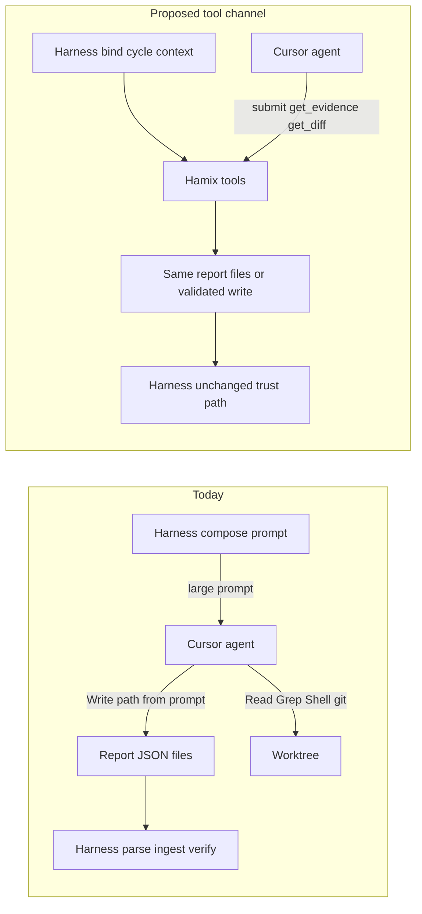

# Agent tools audit (MCP-style opportunities)

Inventory of Hamix-owned tool calls that could reduce prompt cost and freeform agent mistakes in the execute/verify loop — scored for ROI against token usage, variability, and determinism.

| | |
| --- | --- |
| **Applies to** | `pkgs/agents/harness`, Cursor execute/verify agents, side-channel reports under `HAMIX_WORKER_REPORT_DIR` |
| **Audience** | Contributors evaluating agent↔harness contracts; product decisions before an MCP ADR |
| **Prerequisite** | [execute-agent.md](./execute-agent.md), [verify-agent.md](./verify-agent.md), [harness.md](./harness.md) |
| **Status** | v1 shipped — `hamix.submit_criteria_report` / `hamix.submit_verify_report` (tool-only default); see [agent-mcp.md](./agent-mcp.md) |

## In this article

- [Overview](#overview)
- [Key concepts](#key-concepts)
- [How it works today](#how-it-works-today)
- [Current prompt cost map](#current-prompt-cost-map)
- [Freeform failure modes](#freeform-failure-modes)
- [Candidate tools (ROI)](#candidate-tools-roi)
- [Non-candidates](#non-candidates)
- [Recommended priority](#recommended-priority)
- [Limitations](#limitations)
- [See also](#see-also)

## Overview

Today the Cursor execute/verify agent **never calls taskapi HTTP**. The harness composes a large prompt, the agent uses Cursor built-ins (Read/Edit/Shell) plus git in the worktree, and it writes side-channel JSON (`criteria-report.json`, `verify-report.json`). The harness parses those files, runs worker `verify_commands`, enforces integrity, and owns completions and cycle lifecycle.

This audit asks: **which Hamix-owned tools** (for example MCP exposed to Cursor CLI) would help the agent and the harness, scored on three gains:

| Gain | Meaning |
| --- | --- |
| **Tokens** | Less prompt stuffing; fetch evidence on demand |
| **Variability** | Fewer freeform path/schema/SHA mistakes across runs |
| **Determinism** | Structured steps (validate → write → ingest) instead of “hope the agent wrote the right file” |

### In scope

- Execute and verify phases, including polish / operator-retry / process-resume prompt paths
- Side-channel report dir and commit claim ingest
- Cursor CLI tool-call surface as it relates to Hamix contracts

### Out of scope

- Implementing an MCP server or wiring tools into the worker
- Operator SPA HTTP as agent tools
- Changing the trust model (agent remains untrusted for final acceptance)

## Key concepts

| Term | Meaning |
| --- | --- |
| **Tool** | A structured capability the Cursor agent can invoke (MCP or equivalent), bound to the current cycle by the worker — not raw `curl` to taskapi. |
| **Side-channel** | Files under `HAMIX_WORKER_REPORT_DIR/<cycle_id>/` that the harness owns for parse/ingest/GC. |
| **Trust boundary** | Execute **asserts** (`claimed_done`); verify LLM + worker commands + git integrity **decide**; harness writes checklist completions. |
| **Prompt stuffing** | Embedding large blobs (diff, command previews, schema, evidence) in every `runner.Run` prompt instead of letting the agent fetch them. |
| **ROI scores** | **H** / **M** / **L** per gain and overall — qualitative, relative to other candidates in this audit. |

> **Important** — Candidate tools must not mark criteria done, start/terminate cycles, or skip integrity. Those remain harness/operator owned. See [done-criteria.md](./done-criteria.md) and [execute-and-verify.md](../execute-and-verify.md).

## How it works today

| Channel | Writer | Reader |
| --- | --- | --- |
| Composed prompt | Harness | Agent |
| `criteria-report.json` / `verify-report.json` | Agent | Harness parsers |
| `checks/<criterion_id>/<seq>.*` | Harness (verify commands) | Verify prompt (preview) + agent (if it opens paths) |
| `task_cycle_commits` | Harness from MCP commit register | Verify/resume prompts, HTTP |
| Cursor built-ins + git | Agent | Agent |

Compose entry points: [`cycle_loop.go`](../../pkgs/agents/harness/cycle_loop.go) (`composeExecutePrompt`), [`internal/verify/llm.go`](../../pkgs/agents/harness/internal/verify/llm.go), [`cursor_resume.go`](../../pkgs/agents/harness/cursor_resume.go) (same-chat verify rebuilds the full verify contract — [ADR-0085](../adr/ADR-0085-verify-resumes-execute-session.md)).

## Current prompt cost map

### Execute

| Block | Source | Scale | Notes |
| --- | --- | --- | --- |
| Git commit policy | `AppendGitCommitPolicy` | ~0.5–1 KiB static | Every execute in a git worktree |
| Polish / resume / continuation notices | `AppendPolishNotice`, resume/continuation composers | 0.5–several KiB | Known commits list unbounded by count; porcelain capped ~2 KiB |
| Criteria + inline schema + report path | `InjectCriteria` | Schema ~0.4 KiB + N×(id+text) | Schema and path repeated on fresh execute and some recovery paths |
| Operator `initial_prompt` | Task row | Operator-controlled | Often the largest execute slice |
| Prior verify feedback | `AppendVerifyFeedback` | Fail reasoning strings | On verify-fail retry |
| Execute recovery delta | `ComposeRecoveryDelta` | Hard cap **8 KiB** | Framing only when `--resume` |

### Verify (dominant cost)

| Block | Source | Cap / scale | Notes |
| --- | --- | --- | --- |
| Role + path + schema | `llm.go`, `verify_contract.go` | Small | Must stay correct for parse |
| Active criteria + **execute evidence** | Verify contract lines | Evidence ≤**16 KiB** per field | Inlined every verify / same-chat resume |
| Command evidence | `FormatCommandEvidenceSection` | Stdout preview ≤**4 KiB** or first **N** lines per command | Full streams already on disk under `checks/` |
| Task-wide git context | `FormatGitContextForPrompt` | Grows with indexed commits | From `ListCommitsForTask` |
| **`Diff:` = `git diff HEAD`** | `internal/verify/diff.go` | Truncate at **200 KiB** | Largest single prompt blob |
| Prior verify feedback | Appended on retry | Variable | |

> **Note** — Same-chat verify intentionally rebuilds the full verify contract into the resume delta so the report schema and evidence stay intact. That protects correctness and costs tokens ([ADR-0085](../adr/ADR-0085-verify-resumes-execute-session.md)).

### Size summary

| Class | Rough scale |
| --- | --- |
| Static policy/schema | ~1–3 KiB per phase |
| Criteria text + evidence | O(criteria × evidence) |
| Command previews | O(commands × ≤4 KiB) |
| Diff | up to **~200 KiB** per verify prompt |
| Execute resume delta | ≤ **8 KiB** |
| Verify resume delta | Unbounded (full contract) |

## Freeform failure modes

| Agent freeform mistake | Harness effect | Refs |
| --- | --- | --- |
| Wrong report path / write under `repo_root` | Missing report → probe/recovery; often **full re-execute** | [`criteria_parse.go`](../../pkgs/agents/harness/internal/reports/criteria_parse.go), [`execute/probe.go`](../../pkgs/agents/harness/internal/execute/probe.go), [ADR-0028](../adr/ADR-0028-in-cycle-verify-only-retry.md) |
| Extra JSON keys / bad `schema_version` / missing IDs | Invalid report → full re-execute class | `DisallowUnknownFields`, `retry_mode.go` `full_reexecute_report_invalid` |
| Evidence / reasoning over **16 KiB**; verified=true with reasoning shorter than **40** chars | Parse fail | `maxFieldBytes`, `minVerifyReasoning` |
| `claimed_done: false` | Self-claim gate fail; no LLM for that id; implementation retry class | [`checks.go`](../../pkgs/agents/harness/internal/verify/checks.go) |
| Empty commit register | Terminal `execute_missing_commits` | [ADR-0093](../adr/ADR-0093-mcp-commit-register.md), [cycle-commits.md](./cycle-commits.md) |
| HEAD commits not in register | Terminal `execute_unregistered_commits` | [`git/commits.go`](../../pkgs/agents/harness/internal/git/commits.go) |
| Register SHA not in `cycle_base..HEAD` / unresolvable | Terminal `execute_invalid_commit` | [`git/commits.go`](../../pkgs/agents/harness/internal/git/commits.go) |
| Amend / rebase / history rewrite | Prompt policy only; can orphan indexed SHAs | `AppendGitCommitPolicy` |
| Mutate worktree or HEAD during verify | Terminal **`verify_tampered`** (no retry) | [`git/integrity.go`](../../pkgs/agents/harness/internal/git/integrity.go) |
| Missing Cursor `session_id` (same-chat) | Terminal `cursor_missing_session_id` | `enforceExecuteSessionID` in `cycle_loop.go` |

## Candidate tools (ROI)

Scores: **H** = strong hit on that gain, **M** = moderate, **L** = weak. **Overall** is relative priority within this audit.

Binding assumption for all candidates: worker injects **cycle_id + phase + report_dir** into the tool server; the agent does not choose arbitrary filesystem roots.

### High ROI

| Tool | Purpose | Who | Tokens | Variability | Determinism | Overall | Prompt impact | Risks |
| --- | --- | --- | --- | --- | --- | --- | --- | --- |
| `hamix.submit_criteria_report` | Validate schema, expected active IDs, unknown fields; atomically write `criteria-report.json` | Both | M | **H** | **H** | **H** | Replaces path/schema boilerplate | Agents may still Write around the tool unless prompts require it |
| `hamix.submit_verify_report` | Same for `verify-report.json` (incl. reasoning length rules) | Both | M | **H** | **H** | **H** | Replaces path/schema | Same bypass risk; judgment remains freeform in args |
| `hamix.get_cycle_contract` | Paths, active/locked IDs, schema version, phase, attempt | Agent | **H** | **H** | **H** | **H** | Replaces repeated path/schema/locked lists | Must refresh after scrub; cycle-bound only |
| `hamix.get_command_evidence` | List check artifacts; optional full/paged stdout/stderr by criterion | Agent (verify) | **H** | M | M | **H** | Replaces stuffing full command preview section | Agent may under-fetch → weaker verdicts |
| `hamix.get_diff` / `get_git_context` | On-demand / paged diff and indexed commits | Agent (verify) | **H** | M | M | **H** | Replaces up to 200 KiB inline `Diff:` + growing commit ledger | Under-fetch; need page bounds |

### Medium ROI

| Tool | Purpose | Who | Tokens | Variability | Determinism | Overall | Prompt impact | Risks |
| --- | --- | --- | --- | --- | --- | --- | --- | --- |
| `hamix.validate_report` (dry-run) | Parse without committing the file; return exact errors | Agent | L | **H** | **H** | M | Additive; fewer recovery loops | Extra round-trips; still need final submit |
| `hamix.commit` | Commit current index; append SHA to cycle register | Agent (execute) | M | **H** | **H** | **H** | Removes claim SHA transcription | Agents may still Shell-commit (fail closed via I2) |
| `hamix.get_active_criteria` | Structured checklist (id, text, locked) | Agent | M | M | M | M | Partial replace of criteria bullets | Text still needed in context somehow |
| `hamix.get_prior_verify_feedback` | Last failure reasons / locked set | Agent (retry) | M | M | M | M | Replaces appended feedback on fresh prompts | Overlap with same-chat history |
| `hamix.working_tree_status` | Porcelain + HEAD for “don’t mutate” awareness | Agent | L | L | M | M | Additive | Race with integrity snapshot; does not replace integrity |

### Low ROI

| Tool | Purpose | Who | Tokens | Variability | Determinism | Overall | Prompt impact | Risks |
| --- | --- | --- | --- | --- | --- | --- | --- | --- |
| `hamix.get_scope_files` | Continuation scope lock as structured list | Agent | M | M | L | L–M | Partial replace on resume only | Niche path |
| `hamix.preview_stdout` by raw path | Read capped stdout under report dir | Agent | M | L | L | L | Additive to get_command_evidence | Path traversal unless sandboxed; subsumed by get_command_evidence |
| Harness ingest of Cursor `tool_call` results instead of JSON files | Alternate wire | Harness | L | M | M | L today | Parallel channel | Adapter format churn; dual paths |

## Non-candidates

| Idea | Why not |
| --- | --- |
| Agent → taskapi HTTP (checklist `done:true`, cycle complete, status) | Breaks trust model; agent is not completion authority |
| Agent runs `verify_commands` | Worker-owned independent evidence ([ADR-0012](../adr/ADR-0012-structured-verify-commands.md)) |
| Tool that writes checklist completions | Completions only after harness terminal success |
| Start / terminate cycle, cancel, approve, polish, retry | Operator / worker lifecycle |
| Disable integrity or whitelist dirty verify | Undermines fail-closed `verify_tampered` |
| Auto-pass on exit code 0 | Explicitly rejected in verify design |
| Amend / rebase / force-push helpers | Contradicts additive-only commit policy |
| Full `/repo/search|symbols|file|diff` MCP mirror | Cursor already has Read/Grep/Shell; low harness-contract win |
| Re-introduce project memory injection via tools | Removed in [ADR-0087](../adr/ADR-0087-remove-project-context.md) |
| Tools that mutate `repo_root` during verify | Integrity terminal fail |
| Arbitrary report-dir write without schema | Same freeform failures as today |

## Recommended priority

1. **~~Validated report submitters~~ (done)** — `hamix.submit_criteria_report` / `hamix.submit_verify_report` ship with tool-only receipts by default ([agent-mcp.md](./agent-mcp.md), [ADR-0089](../adr/ADR-0089-agent-mcp-platform.md)).
2. **On-demand verify evidence and diff** (`get_command_evidence`, `get_diff` / `get_git_context`) — largest remaining **token** win.
3. **`get_cycle_contract`** — collapse repeated path/schema/locked boilerplate across fresh execute, recovery, and polish.
4. **~~Early commit claim/validate~~ (done as `hamix.commit`)** — [ADR-0093](../adr/ADR-0093-mcp-commit-register.md).

Do **not** open HTTP, completion ledger, or cycle FSM to the agent.

### Suggested next slices

| Step | Tools | Expected gain |
| --- | --- | --- |
| 1 | `get_command_evidence` + stubbed command section in verify prompt | Tokens |
| 2 | `get_diff` (paged) + short “call tool for full diff” stub | Tokens |
| 3 | `get_cycle_contract` | Tokens + variability |

## Limitations

- ROI scores are qualitative; measure token deltas and report-invalid retry rates.
- Tools only help if prompts **require** them (or harness rejects freeform side-channel writes). v1 submit tools use tool-only receipts by default.
- On-demand evidence/diff can **hurt** determinism if the agent skips fetches; pair with clear verify instructions (“you must call X before judging”).
- Same-chat verify still needs a durable contract somewhere (tool fetch or prompt); removing all stuffing without a fetch step regresses ADR-0085 guarantees.

## See also

### Documentation

| Doc | Content |
| --- | --- |
| [agent-mcp.md](./agent-mcp.md) | Tool-only MCP submit platform (ADR-0089) |
| [execute-agent.md](./execute-agent.md) | Execute prompt composition and criteria self-report |
| [verify-agent.md](./verify-agent.md) | Verify LLM, commands, integrity, retries |
| [harness.md](./harness.md) | Cycle loop, side-channel reports, recovery reasons |
| [cycle-commits.md](./cycle-commits.md) | MCP commit register (ADR-0093) |
| [cursor-session-resume.md](./cursor-session-resume.md) | Cursor `--resume` and recovery deltas |
| [done-criteria.md](./done-criteria.md) | Criteria lifecycle and completion ledger |
| [execute-and-verify.md](../execute-and-verify.md) | End-to-end execute + claim acceptance contract |
| [ADR-0012](../adr/ADR-0012-structured-verify-commands.md) | Worker shell verify commands |
| [ADR-0028](../adr/ADR-0028-in-cycle-verify-only-retry.md) | In-cycle verify-only vs full re-execute |
| [ADR-0093](../adr/ADR-0093-mcp-commit-register.md) | MCP commit register |
| [ADR-0084](../adr/ADR-0084-executor-owned-verify.md) | Executor-owned verify |
| [ADR-0085](../adr/ADR-0085-verify-resumes-execute-session.md) | Verify resumes execute session |

### Code

| Path | Role |
| --- | --- |
| [`pkgs/agents/harness/cycle_loop.go`](../../pkgs/agents/harness/cycle_loop.go) | Execute/verify loop, `composeExecutePrompt` |
| [`pkgs/agents/harness/internal/prompt/`](../../pkgs/agents/harness/internal/prompt/) | Criteria, resume, polish, recovery, verify contract |
| [`pkgs/agents/harness/internal/verify/llm.go`](../../pkgs/agents/harness/internal/verify/llm.go) | Verify prompt assembly |
| [`pkgs/agents/harness/internal/verify/diff.go`](../../pkgs/agents/harness/internal/verify/diff.go) | Diff capture and 200 KiB truncate |
| [`pkgs/agents/harness/internal/reports/criteria_parse.go`](../../pkgs/agents/harness/internal/reports/criteria_parse.go) | Report schema validation |
| [`pkgs/agents/harness/internal/orchestration/retry_mode.go`](../../pkgs/agents/harness/internal/orchestration/retry_mode.go) | Report-invalid → full re-execute |
| [`pkgs/agents/runner/cursor/`](../../pkgs/agents/runner/cursor/) | Cursor CLI adapter; streams `tool_call` progress |
