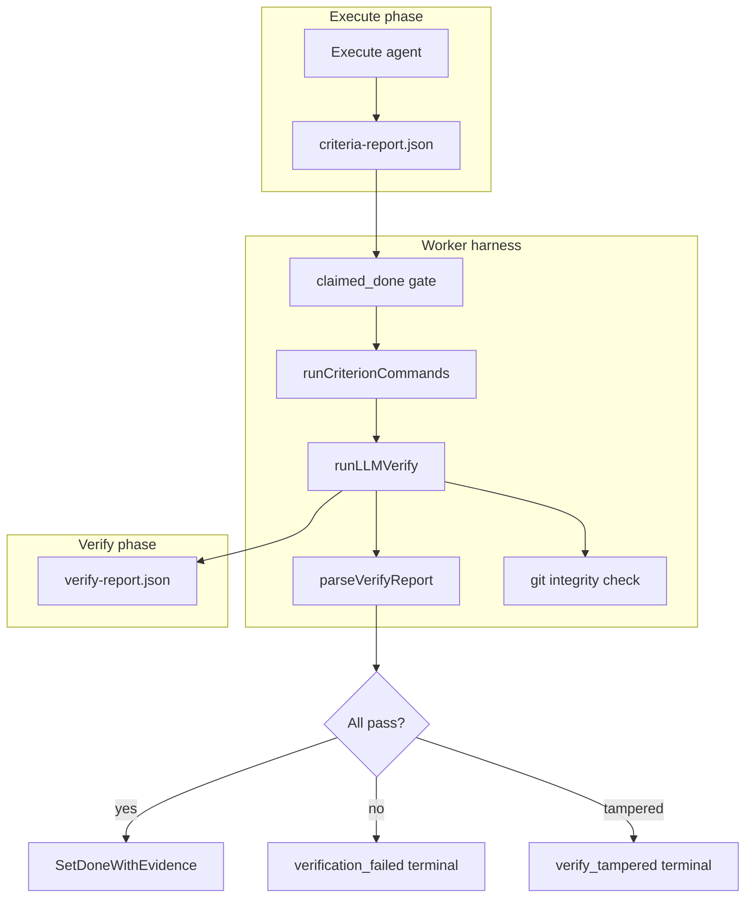

# Verify phase

How the verify phase judges done criteria after execute: claim-only acceptance (`execute_claim`), command-backed LLM verify, git integrity, and one-shot failure ([ADR-0090](../adr/ADR-0090-command-only-verify.md)).

> **Product default (ADR-0090)** — Criteria **without** `verify_commands` are accepted from the execute criteria report (`verified_by=execute_claim`) with no Cursor verify run. Criteria **with** commands run worker checks then a verify LLM that only matches `expected_outcome` to captured output. Each cycle is **one-shot**: one execute, at most one command-verify; any failure terminates the cycle. Operators recover via **Retry** / **Start over** (new cycle).

| | |
| --- | --- |
| **Applies to** | Agent worker harness, verify prompt contract, cycle verdict API |
| **Audience** | Contributors touching `pkgs/agents/harness`, verify settings, or verdict UI |
| **Prerequisite** | [done-criteria.md](./done-criteria.md) — full criteria lifecycle and completion ledger |
| **Companion article** | [execute-agent.md](./execute-agent.md) — execute phase prompt composition and criteria self-report; [harness.md](./harness.md) — cycle loop and one-shot orchestration |

## In this article

- [Overview](#overview)
- [Key concepts](#key-concepts)
- [How it works](#how-it-works)
- [Verification workflow](#verification-workflow)
- [Verify prompt contract](#verify-prompt-contract)
- [Criterion commands](#criterion-commands)
- [Outputs and durability](#outputs-and-durability)
- [Integrity enforcement](#integrity-enforcement)
- [Configuration](#configuration)
- [Best practices](#best-practices)
- [Limitations](#limitations)
- [See also](#see-also)

## Overview

The **verify phase** runs after execute when a task has at least one done criterion **with** `verify_commands`. Claim-only criteria (no commands) are accepted from the execute criteria report without a Cursor verify run (`verified_by=execute_claim`).

For command-backed criteria, the **same execute agent** (same `runner.Runner`) writes `verify-report.json`. On success the worker persists `verified_by=execute_agent` (`verifier_kind=execute_agent` in verdict mirrors).

This is **self-grading with guardrails**: a phase barrier lets the worker run shell checks and assemble evidence before the LLM judges; git integrity still forbids working-tree mutation during `PhaseVerify`.

Three roles participate:

| Role | Responsibility |
| --- | --- |
| **Execute agent** | Implements work in `PhaseExecute`; writes `criteria-report.json` (`claimed_done` + evidence). Assertion only — cannot mark criteria done in the completion ledger. |
| **Worker (harness)** | Gates on `claimed_done`, runs optional shell checks, assembles the verify prompt, invokes the execute runner for `PhaseVerify`, parses `verify-report.json`, enforces git integrity, and decides pass / retry / fail. |
| **Agent verify** (`PhaseVerify`) | Same agent identity as execute; reads evidence and returns per-criterion `verified` + `reasoning`. |

> **Note** — Tasks with **zero criteria** (legacy rows) skip verify entirely; a successful execute alone marks the task `done`. See [data-model.md](../data-model.md).

Execute-side prompt composition: [execute-agent.md](./execute-agent.md). Schema: [data-model.md](../data-model.md) (Checklist). HTTP: [api.md](../api.md).

## Key concepts

| Term | Definition |
| --- | --- |
| **Self-claim gate** | Worker check that `claimed_done` is true before sending a criterion to LLM verify. |
| **Command evidence** | Worker-captured stdout/stderr/meta from shell verify commands; input to the verify prompt. |
| **Claim-only criterion** | No `verify_commands`; harness accepts `claimed_done: true` from execute without PhaseVerify (`verified_by=execute_claim`). |
| **Verify tampered** | Terminal cycle outcome when git integrity detects working-tree or HEAD changes during verify. |
| **Executor-owned verify** | `PhaseVerify` always uses the execute runner; no separate verify runner ([ADR-0084](../adr/ADR-0084-executor-owned-verify.md)). |

### Actors and trust

| Actor | Responsibility | Trust level |
| --- | --- | --- |
| Execute agent | Implement work; write `criteria-report.json` | Self-assertion only |
| Worker | Gate, shell commands, prompt assembly, parse reports, git snapshots | Trusted orchestrator |
| Agent verify (same runner) | Per-criterion pass/fail + reasoning in `verify-report.json` | Trusted verdict when integrity holds; accepted self-grade bias |

> **Important** — The worker does **not** auto-pass a criterion when a verify command exits 0. Shell output is evidence for the agent to interpret in verify. See [ADR-0012](../adr/ADR-0012-structured-verify-commands.md).

> **Note** — There is no second model or adversarial judge. Mitigations for self-grading: worker-owned command evidence, minimum reasoning length when `verified=true`, git integrity during verify, and honest operator docs.

## How it works



Report files live under `HAMIX_WORKER_REPORT_DIR` (outside `repo_root`). The execute runner receives `WorkingDir` set to `repo_root` for both phases so the agent can inspect uncommitted changes via diff and file tools.

## Verification workflow

1. **Execute** — The execute agent finishes work and writes `criteria-report.json` to the worker-managed report dir. The prompt prepends all active criteria with stable ids. See [`criteria_prompt.go`](../../pkgs/agents/harness/criteria_prompt.go).

2. **Gate** — For each criterion, if `claimed_done` is false, the worker records an immediate failure (`verified_by=agent_self`, reasoning: execute did not claim done). Those ids are **not** sent to the verify LLM. See `runVerifyChecks` in [`internal/verify/checks.go`](../../pkgs/agents/harness/internal/verify/checks.go).

3. **Claim-only path** — Criteria with `claimed_done: true` and **no** `verify_commands` are accepted from the execute report. Completions use `verified_by=execute_claim`; no PhaseVerify Cursor run.

4. **Worker commands** — For criteria with `claimed_done: true` and attached `verify_commands`, the worker runs each command sequentially via shell (`sh -c` / `cmd /C`) in `WorkingDir` (`app_settings.repo_root`). stdout, stderr, and meta JSON are written under `<report_dir>/<cycle_id>/checks/<criterion_id>/<seq>.*`. While each command runs, the worker emits live progress (`tool=verify_command`, stream `source=worker`) so the SPA cycles ticker is not blank before the LLM starts. See [`commands.go`](../../pkgs/agents/harness/internal/verify/commands.go) and [ADR-0012](../adr/ADR-0012-structured-verify-commands.md).

5. **Verify LLM** (command-backed only) — The harness builds the verify prompt (below), then calls the **execute** `runner.Run` with `phase=verify` and `WorkingDir` set to the repo root. PhaseVerify always resumes the execute Cursor session (`same_chat`). Implementation: `runLLMVerify` in [`internal/verify/llm.go`](../../pkgs/agents/harness/internal/verify/llm.go).

6. **Parse and decision** — The worker parses `verify-report.json` for command-backed criteria. All criteria pass → atomic `SetDoneWithEvidence` with `verified_by=execute_agent` or `execute_claim` and task `done`. Any fail → terminate with `verification_failed:<id>,...` and **no** completion rows (one-shot; no in-cycle retry).

## Verify prompt contract

The prompt is assembled in `buildVerifyPrompt` ([`internal/verify/llm.go`](../../pkgs/agents/harness/internal/verify/llm.go)). Section order:

1. Role line: continuation of the implementer — you implemented this task; now verify against the criteria. Do not modify source files.
2. Output path: write only the absolute path to `verify-report.json` (under `HAMIX_WORKER_REPORT_DIR`, not under `repo_root`).
3. JSON schema: `{"criteria":[{"id":"...","verified":true|false,"reasoning":"..."}]}`.
4. **Active criteria** — For each command-backed criterion with `claimed_done: true`: `[id] text`, execute evidence string.
5. **Command evidence** (when commands ran) — Per command: command string, expected outcome, exit code, duration, paths to stdout/stderr/meta, optional stdout preview. No stderr preview. See `formatCommandEvidenceSection` in [`verify_commands.go`](../../pkgs/agents/harness/verify_commands.go).
6. **`Diff:`** — Output of `git diff HEAD` (truncated at 200 KiB), or a clean-tree hint when commit policy is on and the tree is clean. See [`resume_prompt.go`](../../pkgs/agents/harness/resume_prompt.go).

`WorkingDir` (repo root) is passed on `runner.Request`, not repeated in the prompt text. The agent can use its normal tools to read files in the repo if the diff and previews are insufficient.

### Example prompt (illustrative)

```text
You implemented this task. Now verify each criterion below against the repo and evidence.
Do not modify source files.
Write `/tmp/hamix-worker/cycle-abc123/verify-report.json` only.

Schema: {"criteria":[{"id":"...","verified":true|false,"reasoning":"..."}]}

- [crit-001] Add a health check endpoint that returns 200 with {"status":"ok"}
  execute claimed_done: true (assertion only)
  execute evidence: Added GET /health in handler_health.go; returns JSON status ok.

- [crit-002] All existing tests pass
  execute claimed_done: true (assertion only)
  execute evidence: Ran go test ./... locally; all green.

## Command evidence (worker-executed)

### [crit-002] command 0
Command: go test ./... -count=1
Expected outcome: all tests pass with exit code 0
exit_code=0 duration_ms=8421 truncated=false
stdout: `/tmp/hamix-worker/cycle-abc123/checks/crit-002/0.stdout`
stderr: `/tmp/hamix-worker/cycle-abc123/checks/crit-002/0.stderr`
meta: `/tmp/hamix-worker/cycle-abc123/checks/crit-002/0.meta.json`
stdout preview:
```
ok  	github.com/example/pkg/foo	0.012s
...
```

Diff:
diff --git a/pkgs/tasks/handler/handler_health.go b/pkgs/tasks/handler/handler_health.go
...
```

On operator **Resume from failure** (new cycle), cross-cycle locked criteria and verify feedback may appear in the execute prompt — see [retry-resume.md](./retry-resume.md).

### Expected verify output

```json
{
  "criteria": [
    {
      "id": "crit-001",
      "verified": true,
      "reasoning": "Diff adds GET /health returning {\"status\":\"ok\"} as required."
    },
    {
      "id": "crit-002",
      "verified": false,
      "reasoning": "go test output shows 1 failure in pkgs/tasks/handler."
    }
  ]
}
```

Parser rules ([`criteria_parse.go`](../../pkgs/agents/harness/criteria_parse.go)): report file ≤ 256 KiB; `reasoning` ≤ 16 KiB; when `verified=true`, `reasoning` must be ≥ 40 characters; no duplicate ids; symlinks rejected.

## Criterion commands

Operators attach optional shell checks per criterion via `verify_commands` on task create or checklist API. Limits: 5 commands per criterion; command ≤ 512 chars; `expected_outcome` ≤ 2048 chars ([`verify_commands.go`](../../pkgs/taskchecklist/domain/verify_commands.go)). Optional `timeout_seconds` (> 0) caps that command; omit or null means no wall-clock timeout (cancel only via the parent cycle context).

| Property | Behavior |
| --- | --- |
| Who runs them | Worker harness, not the LLM |
| When | After gate, before verify LLM; only for `claimed_done: true` |
| Where | Task worktree / `repo_root` (execute's uncommitted changes visible) |
| Timeout | Per-command `timeout_seconds`; omit/null = unlimited |
| Output cap | 256 KiB per stdout/stderr stream; `truncated=true` in meta when clipped |
| stdout preview in prompt | Full content if ≤ 4 KiB; else first 40 lines (or first 4 KiB) |
| Exit code 0 | Does **not** auto-pass the criterion |

Command failures (non-zero exit, timeout, start error) are included in the evidence bundle; the verify LLM still runs and decides.

> **Warning** — Commands that mutate the working tree can trigger `verify_tampered` on the post-verify git snapshot. Prefer read-only checks (tests, lint, grep).

Evidence file layout:

```text
<report_dir>/<cycle_id>/checks/<criterion_id>/<seq>.stdout
<report_dir>/<cycle_id>/checks/<criterion_id>/<seq>.stderr
<report_dir>/<cycle_id>/checks/<criterion_id>/<seq>.meta.json
```

Durable index: `task_cycle_command_runs` (see [data-model.md](../data-model.md)). SPA timeline: `GET /tasks/{id}/cycles/{cycleId}/verdicts` → `command_runs[]`.

## Outputs and durability

| Artifact | Writer | Lifetime |
| --- | --- | --- |
| `criteria-report.json` | Execute agent | Ephemeral; GC at cycle terminate |
| `verify-report.json` | Execute agent (`PhaseVerify`) | Ephemeral; GC at cycle terminate |
| Check stdout/stderr/meta | Worker | Ephemeral; GC at cycle terminate |
| `task_cycle_criteria_reports` | Worker (mirror) | Durable |
| `task_cycle_verify_reports` | Worker (mirror) | Durable |
| `task_cycle_command_runs` | Worker (mirror) | Durable |
| `task_checklist_completions` | Worker | Written only on terminal cycle success (`verified_by=execute_agent` or `execute_claim`) |

Report dir root: `HAMIX_WORKER_REPORT_DIR` (default `<os.TempDir()>/hamix-worker`). Per-cycle subdirs are created before verify and removed at terminate. See [ADR-0004](../adr/ADR-0004-verdicts-on-the-db.md).

## Integrity enforcement

Before `StartPhase(verify)`, the worker captures `git status --porcelain` and `git rev-parse HEAD`. After verify completes, it captures again. Any working-tree change, HEAD movement, or snapshot error → terminal `verify_tampered` (no retries, no completion rows). Report files live outside the repo, so the whitelist is empty — any porcelain diff during verify is tampering.

> **Warning** — Operators editing the workspace during verify (save, commit, checkout) trip the same check as an agent that mutates the tree during `PhaseVerify`. Do not modify `repo_root` while verify is in flight. Operator-facing summary: [execute-and-verify.md](../execute-and-verify.md#do-not-edit-the-workspace-during-verify).

When the working dir is not a git repo, the check is bypassed (logged once at startup). Non-git fixtures therefore have no tamper enforcement. See [`verify_integrity.go`](../../pkgs/agents/harness/verify_integrity.go) and [ADR-0003](../adr/ADR-0003-verify-component-upgrade.md).

> **Note** — Verify runs in the **same working dir as execute** (where uncommitted changes live) so the agent can inspect actual file contents via diff and runner tools. A fresh git worktree at HEAD would be empty and unusable for verifying execute's edits — see ADR-0003 alternatives.

## Configuration

| Setting | Role |
| --- | --- |
| Per-command `timeout_seconds` | Optional wall-clock on each verify command (omit = unlimited) |
| `max_run_duration_seconds` | LLM verify call wall clock (`0` = no limit) |
| `HAMIX_WORKER_REPORT_DIR` | Scratch root for report files and command evidence |
| `runner`, `cursor_bin`, `cursor_model` | Execute runner used for both execute and verify phases |

Verify prompts include a worker-indexed git context block from **`ListCommitsForTask(task_id)`** plus live `git diff HEAD`. See [cycle-commits.md](./cycle-commits.md).

Full reference: [configuration.md](../configuration.md).

## Best practices

- **Treat verify as a second phase, not a second agent** — Same runner; prompts describe continuation of the implementer.
- **Worker-owned evidence** — Shell checks run without relying on execute honesty; results are in the verify prompt.
- **Execute self-report not trusted** — Gate rejects unclaimed criteria; verify LLM must affirm claimed ones.
- **Git tamper detection** — Fail-safe: snapshot errors and any working-tree mutation during verify terminate the cycle.
- **One-shot cycle** — Any verify or gate failure terminates the cycle; operators start a new attempt via Retry / Start over.
- **Observable** — Metrics (`hamix_verify_verdict_total`, phase duration); DB verdict mirror; `verification_failed:<ids>` terminate reason.
- **Inspects real changes** — Same repo root as execute; diff reflects uncommitted work execute produced.

## Limitations

| Limitation | Detail |
| --- | --- |
| Self-grading bias | Same agent judges its own work; mitigated by worker evidence and integrity checks, not a separate model. |
| Non-deterministic LLM verdicts | No multi-judge ensemble; flaky verdicts possible on command-backed criteria. |
| No deterministic auto-pass | Exit code 0 on verify commands does not mark a criterion done by design ([ADR-0012](../adr/ADR-0012-structured-verify-commands.md)). |
| Integrity requires git | Non-git working dirs skip tamper checks silently per cycle. |
| Prompt is partial | Diff + stdout preview only; full stderr and arbitrary files require the agent to read paths/tools. |
| Truncation | Command output (256 KiB), diff (200 KiB), and stdout preview can hide tail failures. |
| Ephemeral report files | Post-cycle debugging relies on DB verdict rows, logs, or metrics — not JSON files on disk. |
| Mutating verify commands | Can cause `verify_tampered` if they change the working tree. |
| Zero-criteria legacy tasks | Skip verify entirely; execute success alone completes the task. |
| Same working dir | Agent *could* modify source during verify; post-hoc git check catches it (not prevention). |

## See also

### Documentation

| Doc | Content |
| --- | --- |
| [runner-adapters.md](./runner-adapters.md) | Execute runner registry and supervisor wiring |
| [harness.md](./harness.md) | Cycle loop, resume, recovery (orchestration) |
| [execute-agent.md](./execute-agent.md) | Execute pass deep-dive (companion article) |
| [agent-tools-audit.md](./agent-tools-audit.md) | Candidate Hamix tools to cut prompt cost and freeform report mistakes |
| [done-criteria.md](./done-criteria.md) | Full criteria lifecycle (companion article) |
| [data-model.md](../data-model.md) (Checklist) | Schema, worker loop summary, report contracts |
| [api.md](../api.md) | Checklist CRUD, `GET .../verdicts` |
| [ADR-0090](../adr/ADR-0090-command-only-verify.md) | Command-only verify, execute_claim, one-shot cycle |
| [ADR-0084](../adr/ADR-0084-executor-owned-verify.md) | Executor-owned verify decision |
| [ADR-0003](../adr/ADR-0003-verify-component-upgrade.md) | Integrity, locked passes (historical adversarial runner superseded) |
| [ADR-0012](../adr/ADR-0012-structured-verify-commands.md) | Criterion shell checks |
| [ADR-0004](../adr/ADR-0004-verdicts-on-the-db.md) | Durable verdict tables |
| [ADR-0005](../adr/ADR-0005-extract-agent-harness.md) | Harness extraction |

### Code

| File | Content |
| --- | --- |
| [`pkgs/agents/harness/internal/verify/`](../../pkgs/agents/harness/internal/verify/) | Verify pipeline, `runLLMVerify`, `buildVerifyPrompt` |
| [`pkgs/agents/harness/verification.go`](../../pkgs/agents/harness/verification.go) | Harness delegators |
| [`pkgs/agents/harness/verify_commands.go`](../../pkgs/agents/harness/verify_commands.go) | Shell execution and evidence formatting |
| [`pkgs/agents/harness/verify_integrity.go`](../../pkgs/agents/harness/verify_integrity.go) | Pre/post git snapshots |
| [`pkgs/agents/harness/criteria_parse.go`](../../pkgs/agents/harness/criteria_parse.go) | Report paths and parsing |
| [`pkgs/agents/harness/criteria_prompt.go`](../../pkgs/agents/harness/criteria_prompt.go) | Execute criteria injection and verify feedback |
| [`pkgs/agents/harness/README.md`](../../pkgs/agents/harness/README.md) | Harness file map |
