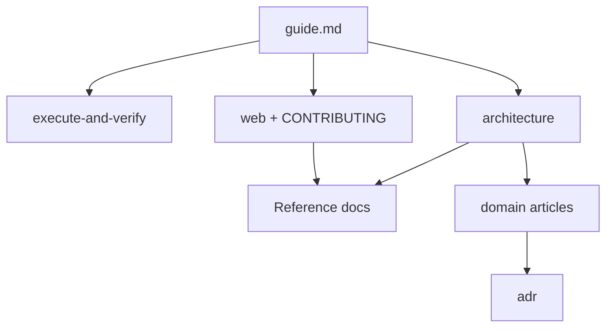

# Documentation guide

How Hamix documentation is organized and which articles to read for your goal.

| | |
| --- | --- |
| **Applies to** | Learning the project, finding the right doc, or onboarding to a work area |
| **Audience** | Operators, contributors, and agents editing the repo |
| **Prerequisite** | Repo checkout; you already have install and run steps from the root README |

## In this article

- [Overview](#overview)
- [Documentation types](#documentation-types)
- [Choose a learning path](#choose-a-learning-path)
- [When to read domain articles and ADRs](#when-to-read-domain-articles-and-adrs)
- [Find docs and code quickly](#find-docs-and-code-quickly)
- [See also](#see-also)

## Overview

Hamix docs are grouped by **purpose**, not by a single reading order. Reference articles answer “what is exposed or stored.” Overview and domain articles answer “how it behaves.” Implementation articles answer “how to change it.”

> **Note** — Read one [learning path](#choose-a-learning-path) below. Open additional articles only when your task requires them.

> **Important** — For code changes, use [agent-map.md](./agent-map.md) for repository locations. Setup and PR checklist: [CONTRIBUTING.md](../CONTRIBUTING.md).

## Documentation types

| Type | Location | Use when you need to… |
| --- | --- | --- |
| Product | [execute-and-verify.md](./execute-and-verify.md) | Create tasks, write checklist items, understand execute vs verify |
| Overview | [architecture.md](./architecture.md) | See how `taskapi`, the store, the worker, and SSE connect |
| Reference | [api.md](./api.md), [data-model.md](./data-model.md), [configuration.md](./configuration.md) | Look up routes, schemas, env vars, or `app_settings` |
| Implementation | [web.md](./web.md), [CONTRIBUTING.md](../CONTRIBUTING.md) | Build UI features; setup and where to find edit docs |
| Deep dive | [domain/](./domain/) | Understand why a subsystem behaves a certain way in production |
| History | [adr/](./adr/) | Learn why a past design decision was made |

## Choose a learning path

Pick **one** row. Follow links left to right. Stop when you have enough context to do your work.

| Goal | Read in order |
| --- | --- |
| **Use Hamix** — create tasks and write criteria | 1. [execute-and-verify.md](./execute-and-verify.md) → 2. [done-criteria.md](./domain/done-criteria.md) (optional) |
| **Understand the system** | 1. [architecture.md](./architecture.md) → 2. [data-model.md](./data-model.md) → 3. [api.md](./api.md) (skim routes) |
| **Work on the API or store** | 1. Understand the system (above) → 2. [agent-map.md](./agent-map.md) → 3. [persistence.md](./domain/persistence.md) as needed |
| **Work on the web UI** | 1. [web.md](./web.md) → 2. [architecture.md](./architecture.md) — SSE / live updates only |
| **Work on agents or harness** | 1. [architecture.md](./architecture.md) → 2. [harness.md](./domain/harness.md) → 3. [execute-agent.md](./domain/execute-agent.md) and/or [verify-agent.md](./domain/verify-agent.md) |
| **Work on tests / CI** | 1. [domain/testing.md](./domain/testing.md) → 2. [harness-testing.md](./domain/harness-testing.md) (harness only) → 3. [CONTRIBUTING.md](../CONTRIBUTING.md) § Before you open a PR |
| **Edit code (human or AI)** | 1. [agent-map.md](./agent-map.md) → 2. relevant domain / reference docs |

## When to read domain articles and ADRs

Open the [domain article index](./domain/README.md) when a learning path points at behavior you need to change — for example harness orchestration, scheduling, SSE, or persistence. Each domain article follows a consistent outline: overview, key concepts, workflow, wire contracts, limitations, and see also.

Open [adr/](./adr/) when you need the historical **why** behind a design, not for day-to-day implementation. Schema, routes, and env vars stay authoritative in reference docs; domain articles and ADRs must not contradict them.

> **Tip** — If you know your topic but not which file to open, use the [Documentation index](./README.md) “Read when” table.

## Find docs and code quickly

| Need | Go to |
| --- | --- |
| Every doc by topic | [Documentation index](./README.md) |
| Domain deep dives | [domain/README.md](./domain/README.md) |
| Repository paths | [agent-map.md](./agent-map.md) |
| Setup and PR checklist | [CONTRIBUTING.md](../CONTRIBUTING.md) |

## See also

- [Documentation index](./README.md) — “Read when” table for all docs under `docs/`
- [domain/README.md](./domain/README.md) — domain article index and writing template
- [agent-map.md](./agent-map.md) — subsystem code paths
- [CONTRIBUTING.md](../CONTRIBUTING.md) — setup, PR checklist, where to go next

New articles under `docs/` should follow the template in [domain/README.md](./domain/README.md) § Article template (metadata table, **In this article**, **See also**).
